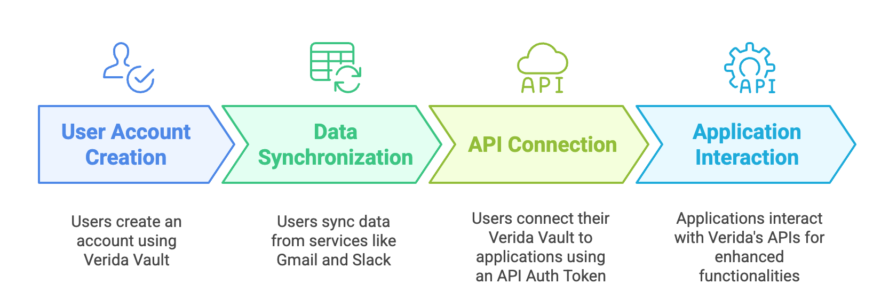

# How it works

Verida AI allows users to easily and quickly connect their private data from other applications into your application or AI product.

<figure><figcaption>
The steps for users to connect their data to your application
</figcaption></figure>

## User Account Creation

Your user creates an account in the [verida-vault.md](../resources/verida-vault.md "mention") ([https://app.verida.ai/](https://app.verida.ai/)) that manages all their private data and application connections.

<figure><figcaption>
Getting started screen from the Verida Vault (https://app.verida.ai/)
</figcaption></figure>

If a user doesn't have an account, they will be prompted to create one when they connect to your application.

## Data Synchronization

Once a user has a Verida Vault account, they can connect to existing third party platforms they use (ie: Google, Telegram, Discord etc.). The Verida Vault will then start syncronizing the user's data in the background. This data is encrypted with private keys owned by the user and stored on the Verida Network.

## API Connection

This works very similar to "Connect Google" or "Connect Facebook" buttons, enabling a user to authorize your application to access their data.

<figure><figcaption></figcaption></figure>

A user clicks a "Connect Verida" button in your application (see [authentication.md](authentication.md "mention") and [developer-console.md](developer-console.md "mention")) and is redirected to the Verida Vault and is presented with a screen allowing them to allow your application to access their data.

<figure><figcaption></figcaption></figure>

## Application Interaction

Once the user has allowed access, they will be redirected to your application and an API auth token will be included in the URL query parameters.

This API auth token can then be used:

1. For a [personalagentkit.md](../integrations/personalagentkit.md "mention") integration such as [langgraph.md](../integrations/langgraph.md "mention").
2. To make direct API requests using the [Data APIs](broken-reference).


Test this complete flow using the [developer-console.md](developer-console.md "mention")


